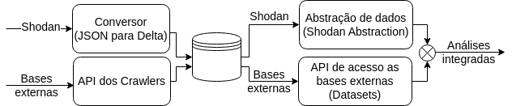

TLHOP Library
================

What is this?
-----------------

TLHOP Library is a Python module that we are developing to help researchers and network administrators to implement and to execute complex queries using large volumes of data provided by device search engines like Shodan or Censys. In this sense, we create a robust and scalable execution environment using Apache Spark, capable of executing complex queries on large volumes of data in a semi-iterative using a functional language interface. We have developed several techniques to enrich Shodan and Censys data and to integrate with external databases, such as Whois/RDAP, CAIDA ASes rankings and a public vulnerability database (NVD), to complement the information collected by search engines about devices and applications. 

| 

All components are exemplified in figure above: Shodan's data about probed devices are transformed and persisted in a more efficient format :doc:`(shodan converter) <shodan_converter>`. Information can be complemented from other databases, made available from :doc:`Crawlers API <datasets_crawlers>` responsible for collecting and archiving. During analyses, data such as those from Shodan can be accessed from a :doc:`data abstraction <shodan_abstraction>` closer to the domain expert and integrated with the external databases. Because our abstraction is based on a Spark-based functional language, it hides implementation complexities, especially aspects of parallel and distributed processing to end-user data, while leveraging Spark's scalability to power increasingly complex analyses.

About the project
-----------------

The project TLHOP (Thread-Limiting Holistic Open Platform) is a technical-scientific project signed between the Centro de Estudos, Resposta e Tratamento de Incidentes de Segurança no Brasil (CERT.br) and the Universidade Federal de Minas Gerais (UFMG) to understand and analyze the network security of the Brazilian internet.

Contents
---------

* :doc:`Installation <setup>`
* :doc:`Converters <dataset_converters>`
* :doc:`TLHOP abstraction <tlhop_abstraction>`
* :doc:`External Datasets & Crawlers <datasets_crawlers>`
* :doc:`API Reference: TLHOP abstraction <api>`

.. toctree::
   :maxdepth: 2
   :hidden:
   :caption: Contents

   setup.rst
   dataset_converters.rst
   tlhop_abstraction.rst
   datasets_crawlers.rst
   api.rst
   

Q&A Support
------------------

For further questions, please submit a `issue <https://github.com/lucasmsp/tlhop-library>`_.

Citation
--------
Please cite TLHOP Library in your publications if it helps your research:

::

   @inproceedings{sbseg,
     author = {Lucas Ponce and Matheus Gimpel and Indra Ribeiro and Etelvina Oliveira and Ítalo Cunha and Cristine Hoepers and Klaus Steding-Jessen and Marcelo Chaves and Dorgival Guedes and Wagner Meira Jr.},
     title = {Um Arcabouço para Processamento Escalável de Vulnerabilidades e Caracterização de Riscos à Conformidade da LGPD},
     booktitle = {Anais do XXIII Simpósio Brasileiro de Segurança da Informação e de Sistemas Computacionais},
     location = {Juiz de Fora/MG},
     year = {2023},
     pages = {15--28},
     publisher = {SBC},
     address = {Porto Alegre, RS, Brasil},
    }

Publication
------------

1. PONCE, Lucas M. et al. Caracterização Escalável de Vulnerabilidades de Segurança: um Estudo de Caso na Internet Brasileira. In: SIMPÓSIO BRASILEIRO DE REDES DE COMPUTADORES E SISTEMAS DISTRIBUÍDOS (SBRC), 40., 2022, Fortaleza, Brazil. Porto Alegre: Sociedade Brasileira de Computação, 2022. p.433-446. DOI: `https://doi.org/10.5753/sbrc.2022.222341`.

2. PONCE, Lucas M. et al. Um Arcabouço para Processamento Escalável de Vulnerabilidades e Caracterização de Riscos à Conformidade da LGPD. In: SIMPÓSIO BRASILEIRO DE SEGURANÇA DA INFORMAÇÃO E DE SISTEMAS COMPUTACIONAIS (SBSEG), 23., 2023, Juiz de Fora, Brazil. Porto Alegre: Sociedade Brasileira de Computação, 2023. p.15-28. DOI: `https://doi.org/10.5753/sbseg.2023.233114`.
